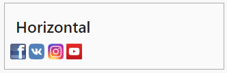

# Social Buttons Widget
```
<div class="social-btns-widget horizontal" data-size="23px">
    <a href="#" class="facebook"></a>
    <a href="#" class="vk"></a>
    <a href="#" class="instagramm"></a>
    <a href="#" class="youtube"></a>
</div>
<script src="js/socialButtonsWidget.js"></script>
```


